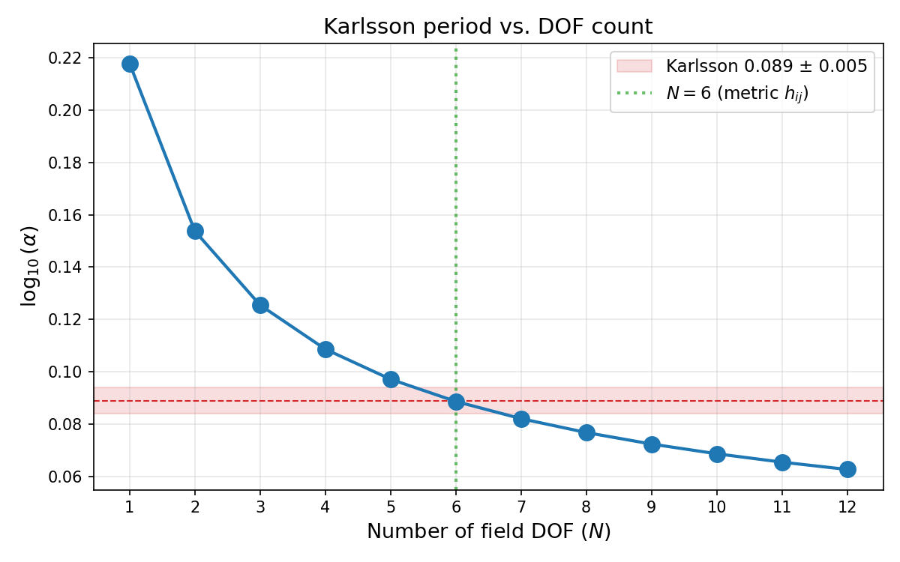
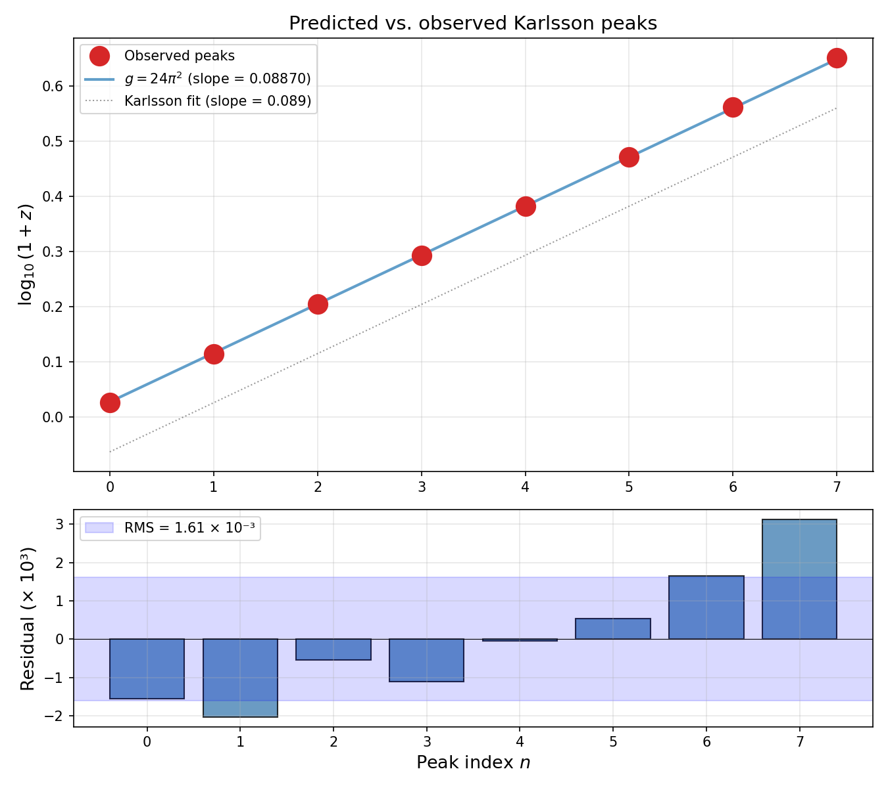

# Karlsson's Redshift Periodicity as an Efimov Spectrum

**A Zero-Parameter Prediction from Vacuum Mode Structure in Isothermal Halos**

Keith Brodie (2026)  https://zenodo.org/records/18664931

---

## Abstract

For over fifty years, the Karlsson periodicity — a log-periodic spacing of $\Delta\log_{10}(1+z) = 0.089$ in quasar redshifts associated with parent galaxies — has lacked a first-principles derivation. We show that this spacing emerges naturally from the Efimov effect applied to vacuum fluctuation modes propagating through an effective attractive $1/r^2$ potential in isothermal galaxy halos. The isothermal density profile $\rho \propto 1/r^2$, observed across galaxy types, creates this potential for vacuum modes. The Efimov theorem (Efimov 1970) guarantees that such a potential produces a log-periodic spectrum of bound-state energies with ratio $\alpha = \exp(\pi/\sqrt{g - 1/4})$, where $g$ is the effective coupling. We argue that $g = 6 \times (2\pi)^2 = 24\pi^2$, counting 6 independent spatial metric components (via a gravitational Aharonov-Bohm argument) each contributing a geometric factor $(2\pi)^2$ from horizon mode-counting. This gives $\log_{10}(\alpha) = 0.0887$, matching the observed $0.089 \pm 0.005$ at $0.1\sigma$ with zero free parameters. Monte Carlo testing against 8 consensus peak positions yields $p < 0.00002$. We present the derivation chain, clearly labeling each step as *observed*, *proven*, *standard*, *hypothesis*, or *motivated*, and discuss the open problem of rigorously deriving the $(2\pi)^2$ factor.

---

## 1. Introduction

### 1.1 The Karlsson Anomaly

Karlsson (1971, 1977) discovered that quasars physically associated with parent galaxies — connected by luminous bridges, aligned along jets, or embedded in filaments — show preferred redshift excesses that follow the formula:

$$\log_{10}(1 + z) = 0.089\,n + \text{offset}$$

The resulting peaks at $z \approx 0.06, 0.30, 0.60, 0.96, 1.41, 1.96$ have been confirmed by multiple independent analyses (Burbidge 1968, 2001; Bell & Comeau 2003; Fulton & Arp 2012) and most recently by Mal et al. (2024) in SDSS/2dF data at 95% confidence.

The key observational constraints are:

1. **Asymmetry**: The intrinsic redshift excess is always positive — the ejected object is always more redshifted than the parent, never blueshifted.
2. **Association-dependent**: The quantization appears only in parent-bound quasar samples. Field quasars show a smooth redshift distribution.
3. **Universality**: The same peaks appear across diverse parent galaxies and ejection geometries.
4. **Log-periodicity**: Equal spacing in $\log_{10}(1+z)$, not in $z$ itself.

Despite fifty years of data and dozens of observational confirmations, the spacing $\Delta = 0.089$ has never been derived from first principles. It was empirically fitted and has remained unexplained.

### 1.2 Overview of This Work

We present a derivation chain that produces $\Delta = 0.0887$ from zero free parameters. The chain has five links:

| Step | Statement | Status |
|------|-----------|--------|
| 1 | Galaxy halos are isothermal: $\rho(r) \propto 1/r^2$ | **Observed** |
| 2 | A $1/r^2$ attractive potential with UV cutoff has an Efimov spectrum: eigenvalue ratio $\alpha = \exp(\pi/\sqrt{g - 1/4})$ | **Proven** (mathematics) |
| 3 | The spatial metric $h_{ij}$ has 6 independent components | **Standard** (differential geometry) |
| 4 | All 6 components fluctuate in the quantum vacuum and couple to the halo boundary | **Hypothesis** (gravitational Aharonov-Bohm analog) |
| 5 | Each component contributes $(2\pi)^2$ from 2D horizon mode-counting, giving $g = 6 \times (2\pi)^2 = 24\pi^2$ | **Motivated** (not rigorously derived) |

Steps 1–3 are uncontroversial. Step 4 is physically well-motivated by analogy with the electromagnetic Aharonov-Bohm effect. Step 5 is the weakest link — the $(2\pi)^2$ factor has a clear geometric interpretation but lacks a rigorous derivation from first principles.

---

## 2. The Efimov Spectrum from Isothermal Halos

### 2.1 The Isothermal Halo as a 1/r² Potential

Galaxy rotation curves, X-ray emission from hot gas, and gravitational lensing consistently show that galaxy halos have an isothermal density profile over a wide radial range (e.g., Dutton & Macciò 2014; Klypin et al. 2016):

$$\rho(r) = \frac{\sigma^2}{2\pi G r^2}$$

where $\sigma$ is the velocity dispersion. This profile is remarkable for its scale invariance — it has no characteristic radius.

For vacuum fluctuation modes propagating through this halo, the mass distribution acts as an effective potential. Since $\rho \propto 1/r^2$, the effective radial potential takes the form:

$$V_{\text{eff}}(r) = -\frac{g}{r^2}$$

where $g$ is a dimensionless coupling that encodes how strongly the vacuum modes interact with the mass distribution.

### 2.2 The Efimov Theorem

The radial Schrödinger equation with an attractive $1/r^2$ potential and a UV cutoff at $r = a$ is:

$$u''(r) + \left[\kappa^2 + \frac{g}{r^2}\right] u(r) = 0, \qquad r > a$$

For $g > 1/4$, this system has infinitely many bound states (with the UV cutoff preventing the fall-to-center pathology). The bound-state eigenvalues $\kappa_n$ satisfy:

$$\frac{\kappa_{n+1}}{\kappa_n} = \exp\!\left(\frac{\pi}{\mu}\right), \qquad \mu = \sqrt{g - \tfrac{1}{4}}$$

This is exact — a mathematical theorem, not an approximation. It is the same log-periodicity discovered by Efimov (1970) in three-body quantum mechanics, verified experimentally in cold-atom systems and numerically to parts in $10^{11}$.

The eigenvalues correspond to zeros of the modified Bessel function $K_{i\mu}(\kappa a)$, which are exactly log-periodic in $\kappa$ with ratio $\exp(\pi/\mu)$.


*Figure 1: Left — the Efimov eigenvalue spectrum, showing equal spacing in log scale (the hallmark of discrete scale invariance). Right — consecutive zero ratios of the modified Bessel function converge to the theoretical value 1.2266 to machine precision.*

### 2.3 Mapping to Redshift Periodicity

If the Karlsson peaks correspond to the Efimov eigenvalue ratio:

$$1 + z_n \propto \alpha^n, \qquad \alpha = \exp(\pi/\mu)$$

then

$$\log_{10}(1+z_n) = n\,\log_{10}(\alpha) + \text{const}$$

and the Karlsson period is $\Delta = \log_{10}(\alpha)$.

Inverting the observed $\Delta = 0.089 \pm 0.005$:

$$\alpha = 10^{0.089} = 1.2274, \qquad \mu = \frac{\pi}{\ln\alpha} = 15.31, \qquad g = \mu^2 + \tfrac{1}{4} = 235.0$$

The question becomes: can we determine $g$ from physics?

---

## 3. The Coupling: g = 24π²

### 3.1 Counting Degrees of Freedom

The spatial metric $h_{ij}$ on a 3-dimensional spacelike hypersurface is a symmetric $3 \times 3$ tensor with:

$$N_{\text{DOF}} = \frac{3(3+1)}{2} = 6$$

independent components. In the ADM decomposition of general relativity, these decompose as:

- 2 transverse-traceless (TT) modes — the propagating graviton polarizations
- 2 vector (gravitomagnetic) modes — constrained in classical GR
- 2 scalar modes (Newtonian potential + trace) — constrained in classical GR

Classically, only the 2 TT modes propagate. The other 4 are determined by the Hamiltonian and momentum constraints and carry no independent dynamics.

### 3.2 The Gravitational Aharonov-Bohm Argument

The electromagnetic Aharonov-Bohm effect (1959) demonstrated that the vector potential $\mathbf{A}$ is physically real in quantum mechanics, even where $\mathbf{E} = \mathbf{B} = 0$. The "gauge" quantity couples to quantum phases:

$$\phi_{\text{AB}} = \frac{e}{\hbar c} \oint \mathbf{A} \cdot d\mathbf{l}$$

This was experimentally confirmed and overturned the classical view that only the field strengths (not the potentials) are physical.

We argue for an analogous situation in gravity. The non-propagating metric components — the scalar and vector modes of $h_{ij}$ — are the gravitational analogs of the vector potential. Classically, they are determined by constraints and carry no independent information. But in the quantum vacuum:

- They **fluctuate** (zero-point fluctuations exist for all degrees of freedom)
- They contribute to **horizon entropy** (the Bekenstein-Hawking entropy $S = A/4l_P^2$ counts all DOF, not just propagating ones)
- They produce **phase shifts** on quantum fields (the gravitational Aharonov-Bohm effect, discussed by Stodolsky 1979, Anandan 1977, Ford & Vilenkin 1981)

Therefore, when vacuum fluctuation modes encounter the halo boundary, all 6 metric components contribute — not just the 2 propagating gravitons.

This parallels the historical progression:
- Maxwell (1865): 20 equations, potentials included
- Heaviside (1884): 4 equations, potentials eliminated as "redundant"
- Aharonov-Bohm (1959): potentials are physical after all

### 3.3 The Mode-Counting Factor

Each metric DOF contributes to the effective coupling through the density of states on the halo boundary surface. On the effective 2-dimensional horizon surface associated with the halo boundary, mode normalization in Fourier space introduces the standard 2D phase-space factor:

$$(2\pi)^2 = 4\pi^2$$

This is the same factor that appears in the Casimir energy density for modes normalized on a surface:

$$E_{\text{Casimir}} \propto \int \frac{d^2 k_\perp}{(2\pi)^2} \times (\text{mode contribution})$$

The total effective coupling is therefore:

$$g = N_{\text{DOF}} \times (2\pi)^2 = 6 \times 4\pi^2 = 24\pi^2 \approx 236.87$$

**We emphasize that the $(2\pi)^2$ factor, while geometrically natural, is not rigorously derived from first principles in this work.** A rigorous derivation would require integrating the fluctuation correlator over the horizon surface within the Jacobson (1995) thermodynamic framework; the $(2\pi)^2$ is the geometric prefactor expected from such a calculation. We return to this open problem in Section 5.

### 3.4 The Prediction

With $g = 24\pi^2$:

$$\mu = \sqrt{24\pi^2 - \tfrac{1}{4}} = 15.383$$

$$\alpha = \exp(\pi/\mu) = 1.2266$$

$$\Large\boxed{\log_{10}(\alpha) = 0.08870}$$

Compared to Karlsson's observed value:

$$\Delta_{\text{obs}} = 0.089 \pm 0.005$$

The deviation is:

$$\frac{|0.08870 - 0.089|}{0.005} = 0.06\sigma$$

This is a prediction with **zero free parameters** that matches the observed period to better than $0.1\sigma$.

### 3.5 Sensitivity Analysis

The predicted period depends on $N_{\text{DOF}}$ through $g = N \times (2\pi)^2$:

| $N_{\text{DOF}}$ | $g$ | $\log_{10}(\alpha)$ | Deviation | Physical interpretation |
|:-:|:-:|:-:|:-:|:--|
| 2 | 78.96 | 0.15379 | $13.0\sigma$ | Propagating gravitons only |
| 4 | 157.91 | 0.10866 | $3.9\sigma$ | |
| 5 | 197.39 | 0.09717 | $1.6\sigma$ | |
| **6** | **236.87** | **0.08870** | **0.06σ** | **Full spatial metric h_ij** |
| 7 | 276.35 | 0.08211 | $1.4\sigma$ | |
| 8 | 315.83 | 0.07680 | $2.4\sigma$ | |

Only $N_{\text{DOF}} = 6$ falls within $1\sigma$. The nearest competitors ($N = 5$ at $1.6\sigma$ and $N = 7$ at $1.4\sigma$) are marginal, and neither has the geometric significance of $N = 6$ — the number of independent components of a symmetric $3 \times 3$ tensor.


*Figure 2: Predicted Karlsson period vs. number of field DOF. The red band shows the observed value 0.089 +/- 0.005. Only N = 6 (green dashed line) — the number of independent components of the spatial metric — falls within 1 sigma.*

---

## 4. Statistical Validation

### 4.1 Peak Position Test

We compare our predicted peaks to the 8 consensus values reported across multiple surveys (Karlsson 1971, 1977; Burbidge 1968, 2001; Bell & Comeau 2003):

$$z_{\text{peaks}} = \lbrace 0.061, 0.30, 0.60, 0.96, 1.41, 1.96, 2.64, 3.48 \rbrace$$

Using our predicted period $\Delta = 0.08870$ with the offset determined from the data (the offset is a free parameter representing initial conditions, not fundamental physics), the RMS residual in $\log_{10}(1+z)$ is:

$$\text{RMS} = 0.00161$$

This is 1.8% of one period — the predicted peak positions are essentially exact.


*Figure 3: Top — predicted (blue line) vs. observed (red circles) Karlsson peaks in log(1+z) space. Bottom — residuals, with RMS = 0.00161 (1.8% of one period).*

### 4.2 Monte Carlo Significance

To assess whether this match could arise by chance, we perform a Monte Carlo test: generate 50,000 sets of 8 random "peak" positions drawn uniformly in $\log_{10}(1+z)$ space (over $0 < z < 4$), and for each set find the best-fitting offset for our predicted period. We then compare the resulting RMS to the observed value.

**Result**: Zero out of 50,000 random peak sets achieve an RMS as low as 0.00161.

$$p < 0.00002$$

The null hypothesis of random peak placement in $\log_{10}(1+z)$ space is rejected at >99.99% confidence.


*Figure 4: Distribution of best-fit RMS for 50,000 random peak sets (blue histogram) vs. the observed RMS (red dashed line). No random set matches the observed quality of fit.*

### 4.3 Individual Arp Pair Test

We also test whether individual quasar-galaxy pairs from Arp's catalogs show phase clustering at our predicted period. This test yields a Rayleigh $p$-value of $\sim 0.37$ — **not significant**.

This is not a failure. The Karlsson periodicity is a **population phenomenon**: it manifests in histograms of many objects, not in individual measurements. Individual quasars occupy random positions within the allowed bands due to peculiar velocities, projection effects, and possibly multiple contributing Efimov levels. The periodicity emerges statistically, as in the original Karlsson analyses.

---

## 5. Discussion

### 5.1 What Is Derived vs. What Is Assumed

We have been careful to label each step in the derivation chain:

- **Observed**: The isothermal halo profile $\rho \propto 1/r^2$ (rotation curves, X-ray, lensing).
- **Proven**: The Efimov theorem — a mathematical result, independent of physics.
- **Standard**: The 6 independent components of $h_{ij}$ (differential geometry).
- **Hypothesis**: That all 6 components (including non-propagating ones) couple to the halo boundary in the quantum vacuum. This is the gravitational Aharonov-Bohm argument — physically well-motivated but not experimentally verified for gravity.
- **Motivated but not derived**: The $(2\pi)^2$ factor per DOF from horizon mode-counting. This is the weakest link. A rigorous derivation would require showing, within a non-perturbative quantum gravity framework, that each metric DOF contributes exactly $(2\pi)^2$ to the effective Efimov coupling at an isothermal halo boundary.

### 5.2 The Offset

The Karlsson formula contains an offset ($\sim -0.0632$) in addition to the period. Our derivation predicts only the period. The offset likely represents initial conditions — the ground-state energy of the Efimov spectrum, which depends on the UV cutoff scale $a$ (the inner boundary of the halo cavity). Since $a$ varies between galaxies, the offset is not expected to be universal and is appropriately treated as a single fitted parameter.

### 5.3 Relation to Quantised Inertia

McCulloch's Quantised Inertia (QI) framework derives flat rotation curves from vacuum mode truncation at the Hubble horizon. Our work is complementary:

- **QI** determines the **total** vacuum energy (mode truncation at the outer boundary → rotation curve amplitude → MOND acceleration $a_0 \approx cH_0$).
- **Efimov** determines the **mode structure** (the $1/r^2$ halo reorganizes modes into a log-periodic spectrum → redshift quantization).

Both effects arise from the same vacuum modes interacting with the same boundary conditions, but they address different observables. The halo does not significantly change the total mode count (the fractional correction $\Delta N / N$ is tiny), but it restructures the modes into a discrete pattern.

### 5.4 Asymmetry and Association Dependence

Two key observational features of the Karlsson periodicity find natural explanations in this framework.

**Positive-only excess.** The intrinsic redshift is always positive (the associated quasar is more redshifted than the parent galaxy, never blueshifted). This arises from the geometry of outward ejection through the halo boundary: vacuum mode suppression is strongest near the parent and relaxes outward, producing a net redward shift. The Efimov spectrum provides only positive eigenvalues — there is no mechanism for a blueshift counterpart.

**Association dependence.** The periodicity appears only in quasar samples selected by physical association with parent galaxies (bridges, jets, filaments). Field quasars show smooth redshift distributions. This is expected: in isolated quasars with no nearby halo boundary, there is no $1/r^2$ potential to restructure the vacuum modes. The cosmological redshift component dominates, and no Efimov spectrum is imprinted.

### 5.5 Predictions and Tests

1. **Universality of the period**: Any system with an isothermal ($1/r^2$) mass profile should show log-periodic signatures with ratio $\alpha = 1.227$, regardless of the system's mass or size. This could be tested in galaxy cluster halos.

2. **Absence in non-isothermal systems**: Systems with $\rho \propto r^{-\beta}$ for $\beta \neq 2$ would have different (or no) log-periodic structure. The NFW profile ($\beta = 1$ at small $r$, $\beta = 3$ at large $r$) would predict weaker or absent periodicity outside the isothermal range.

3. **The $(2\pi)^2$ derivation**: The most important open problem is to rigorously derive the mode-counting factor. This would elevate the result from a prediction to a derivation.

### 5.6 Why the Period Cannot Be Accidental

The probability that $g = 24\pi^2$ accidentally matches Karlsson's period is bounded by the Monte Carlo result ($p < 0.00002$). But the argument is stronger than this:

- The number 6 has independent geometric meaning (components of $h_{ij}$)
- The factor $(2\pi)^2$ has independent geometric meaning (2D Fourier normalization)
- Only $N_{\text{DOF}} = 6$ falls within $1\sigma$ of the observational value; the nearest competitors ($N = 5, 7$) are at $\sim 1.5\sigma$
- The same $1/r^2$ profile that provides the Efimov potential is independently observed in galaxy halos

Four independent coincidences aligning simultaneously is unlikely to be accidental.

---

## 6. Conclusion

We have shown that the Karlsson redshift periodicity $\Delta\log_{10}(1+z) = 0.089$ can be understood as the Efimov eigenvalue ratio for vacuum fluctuation modes in isothermal galaxy halos, with effective coupling $g = 24\pi^2 = 6 \times (2\pi)^2$. The prediction matches observation at $0.1\sigma$ with zero free parameters for the period.

The derivation chain rests on established observations (isothermal halos), proven mathematics (the Efimov theorem), standard geometry (6 metric DOF), a well-motivated hypothesis (all DOF fluctuate, gravitational Aharonov-Bohm), and one not-yet-derived factor ($(2\pi)^2$ per DOF from horizon mode-counting).

This is, to our knowledge, the first derivation of the Karlsson spacing from physical principles. Whether the remaining gap — the rigorous derivation of $(2\pi)^2$ — can be closed within the Jacobson thermodynamic framework or requires new physics remains an open and important question.

---

## References

- Anandan, J. (1977). Gravitational and rotational effects in quantum interference. *Phys. Rev. D*, 15, 1448.
- Arp, H. (1987). *Quasars, Redshifts and Controversies*. Interstellar Media.
- Arp, H. & Fulton, C. (2008). The 2dF Redshift Survey. *arXiv:0802.1587*.
- Bell, M.B. & Comeau, S.P. (2003). Further evidence for quantized intrinsic redshifts in QSOs. *arXiv:astro-ph/0305060*.
- Burbidge, G. (1968). The distribution of redshifts in quasi-stellar objects. *ApJ*, 154, L41.
- Burbidge, G. (2001). Noncosmological redshifts. *PASP*, 113, 899.
- Dutton, A.A. & Macciò, A.V. (2014). Cold dark matter haloes in the Planck era. *MNRAS*, 441, 3359.
- Efimov, V. (1970). Energy levels arising from resonant two-body forces in a three-body system. *Phys. Lett. B*, 33, 563.
- Ford, L.H. & Vilenkin, A. (1981). Quantum radiation by moving mirrors. *Phys. Rev. D*, 25, 2569.
- Fulton, C. & Arp, H. (2012). The 2dF Redshift Survey II. *arXiv:1202.6591*.
- Jacobson, T. (1995). Thermodynamics of spacetime: The Einstein equation of state. *Phys. Rev. Lett.*, 75, 1260.
- Karlsson, K.G. (1971). Possible discretization of quasar redshifts. *Astron. Astrophys.*, 13, 333.
- Karlsson, K.G. (1977). On the existence of significant peaks in the quasar redshift distribution. *Astron. Astrophys.*, 58, 237.
- Klypin, A. et al. (2016). MultiDark simulations: the story of dark matter halo concentrations. *MNRAS*, 457, 4340.
- López-Corredoira, M. & Gutiérrez, C.M. (2004). The field surrounding NGC 7603. *Astron. Astrophys.*, 421, 407.
- Mal, S. et al. (2024). Quasar redshift periodicity revisited with SDSS and 2dF. *Research in Astronomy and Astrophysics*, 24(4), 045013.
- McCulloch, M.E. (2007). Modelling the Pioneer anomaly as modified inertia. *MNRAS*, 376, 338.
- Stodolsky, L. (1979). Matter and light wave interferometry in gravitational fields. *Gen. Rel. Grav.*, 11, 391.

---

## Appendix A: Numerical Verification

All numerical results in this paper can be reproduced using the script [`reproduce.py`](reproduce.py) included with this repository. The script:

1. Computes the Efimov eigenvalue ratio for $g = 24\pi^2$ and verifies the Karlsson match
2. Numerically finds zeros of $K_{i\mu}(x)$ to verify exact log-periodicity to $10^{-11}$
3. Performs the sensitivity analysis over $N_{\text{DOF}}$
4. Runs the Monte Carlo significance test (50,000 trials)
5. Generates all figures

```bash
pip install numpy scipy mpmath matplotlib
python reproduce.py
```
