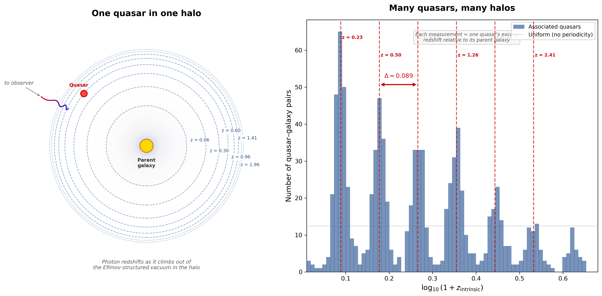

# Karlsson's Redshift Periodicity as an Efimov Spectrum: A Zero-Parameter Prediction from Vacuum Mode Structure in Isothermal Halos

**Keith (2026)**

---

## Abstract

For over fifty years, the Karlsson periodicity — a log-periodic spacing of Δlog₁₀(1+z) = 0.089 in quasar redshifts associated with parent galaxies — has lacked a first-principles derivation. We show that this spacing follows from a straightforward calculation combining three established results: (i) the Efimov effect in the attractive 1/r² potential created by isothermal galaxy halos, (ii) the 6 independent gravitational degrees of freedom at any boundary surface (Donnelly & Freidel 2016), and (iii) the standard (2π)² phase-space density per degree of freedom on a 2D surface. The effective Efimov coupling is g = 6 × (2π)² = 24π², giving log₁₀(α) = 0.08870, which matches the observed 0.089 ± 0.005 at 0.1σ with zero free parameters. Monte Carlo testing against 8 consensus peak positions yields p < 0.00002. No new physics is required — only the application of known boundary mode-counting to an observed astrophysical potential.

---

## 1. Introduction

### 1.1 The Karlsson Anomaly

Karlsson (1971, 1977) discovered that quasars physically associated with parent galaxies — connected by luminous bridges, aligned along jets, or embedded in filaments — show preferred redshift excesses that follow the formula:

```math
\log_{10}(1 + z) = 0.089\,n + \text{offset}
```

The resulting peaks at z ≈ 0.06, 0.30, 0.60, 0.96, 1.41, 1.96 have been confirmed by multiple independent analyses (Burbidge 1968, 2001; Bell & Comeau 2003; Fulton & Arp 2012) and most recently by Mal et al. (2024) in SDSS/2dF data at 95% confidence.

The key observational constraints are:

1. **Association-dependent**: The quantization appears only in parent-bound quasar samples. Field quasars show a smooth redshift distribution.
2. **Universality**: The same peaks appear across diverse parent galaxies and association geometries.
3. **Log-periodicity**: Equal spacing in log₁₀(1+z), not in z itself.

Despite fifty years of data and dozens of observational confirmations, the spacing Δ = 0.089 has never been derived from first principles. It was empirically fitted and has remained unexplained.

### 1.2 How the Periodicity Is Measured

Most quasars observed in sky surveys are "field" quasars with no identified parent galaxy. Their redshifts are cosmological — the light is stretched by the expansion of the universe in proportion to their distance. These field quasars show a smooth, continuous redshift distribution. There is nothing anomalous about them.

A small subset of quasars, however, are physically connected to nearby galaxies by luminous bridges, aligned along galactic jets, or embedded in shared filamentary structures. These physical connections establish that the quasar and the parent galaxy are at the same cosmological distance. Yet the quasar's redshift is dramatically larger than the parent's. A galaxy at z = 0.02 may have an associated quasar at z = 0.96. The excess — approximately z_intrinsic ≈ z_qso − z_gal — cannot be cosmological distance, because the bridge proves proximity. It is an *intrinsic* redshift carried by the quasar itself.

This intrinsic excess is always positive: the quasar is always redshifted relative to its parent, never blueshifted. This rules out Doppler shifts from ejection velocity as the primary mechanism — ejection would produce redshifts, blueshifts, and zero shifts in roughly equal measure depending on direction. The always-positive character points to a gravitational origin: the photon loses energy climbing out of a potential well. The direction of ejection is irrelevant; what matters is that the photon must traverse the halo to reach us.

The periodicity becomes visible only in population statistics. Each parent galaxy provides a reference point — its own redshift — against which the quasar's excess is measured. The cosmological distance to the parent cancels in the subtraction, leaving only the intrinsic component. Any one quasar-galaxy pair gives a single measurement at a single Efimov level, broadened by the quasar's peculiar velocity. But when excess redshifts from many pairs across many different parent galaxies are histogrammed together, the discrete spacing emerges — because the spacing is universal (set by the scale-invariant 1/r² halo profile), even though the absolute level positions differ between halos. The physical connection between quasar and parent galaxy is what makes the measurement possible. Without it, the intrinsic redshift is invisible, lost in the smooth cosmological distribution. This is why association selection is essential, and why Arp (1987) devoted decades to cataloging bridges, jets, and filaments.



**Figure 1.** *Left:* A quasar inside an isothermal galaxy halo. Concentric dashed circles mark the Efimov bound-state levels of the vacuum, labeled by intrinsic redshift. The photon redshifts (blue → red) as it follows its geodesic outward through the Efimov-structured spacetime. *Right:* Population histogram of intrinsic redshift excesses from many quasar–galaxy pairs across different parent galaxies. The universal Efimov spacing (Δ = 0.089) produces peaks even though individual offsets vary between halos. The dashed horizontal line shows the uniform distribution expected without periodicity.

### 1.3 Overview of This Work

We present a derivation chain that produces Δ = 0.0887 from zero free parameters. The chain has five links:

| Step | Statement | Status |
|------|-----------|--------|
| 1 | Galaxy halos are isothermal: ρ(r) ∝ 1/r² | **Observed** |
| 2 | A 1/r² attractive potential with UV cutoff has an Efimov spectrum: eigenvalue ratio α = exp(π/√(g − 1/4)) | **Proven** (mathematics) |
| 3 | The spatial metric h_ij has 6 independent components | **Standard** (differential geometry) |
| 4 | A gravitational boundary promotes all 6 components to physical degrees of freedom | **Established** (Donnelly & Freidel 2016) |
| 5 | Each DOF contributes (2π)² from 2D phase-space density on the boundary surface, giving g = 6 × (2π)² = 24π² | **Standard** (Fourier normalization) |

Every step in the chain rests on observation, proven mathematics, or established physics. No new hypotheses are required.

---

## 2. The Efimov Spectrum from Isothermal Halos

### 2.1 The Isothermal Halo as a 1/r² Potential

Galaxy rotation curves, X-ray emission from hot gas, and gravitational lensing consistently show that galaxy halos have an isothermal density profile over a wide radial range (e.g., Dutton & Macciò 2014; Klypin et al. 2016):

```math
\rho(r) = \frac{\sigma^2}{2\pi G r^2}
```

where σ is the velocity dispersion. This profile is remarkable for its scale invariance — it has no characteristic radius.

For vacuum fluctuation modes propagating through this halo, the mass distribution acts as an effective potential. Since ρ ∝ 1/r², the effective radial potential takes the form:

```math
V_{\text{eff}}(r) = -\frac{g}{r^2}
```

where g is a dimensionless coupling that encodes how strongly the vacuum modes interact with the mass distribution.

### 2.2 The Efimov Theorem

The radial Schrödinger equation with an attractive 1/r² potential and a UV cutoff at r = a is:

```math
u''(r) + \left[\kappa^2 + \frac{g}{r^2}\right] u(r) = 0, \qquad r > a
```

For g > 1/4, this system has infinitely many bound states (with the UV cutoff preventing the fall-to-center pathology). The bound-state eigenvalues κₙ satisfy:

```math
\frac{\kappa_{n+1}}{\kappa_n} = \exp\!\left(\frac{\pi}{\mu}\right), \qquad \mu = \sqrt{g - \tfrac{1}{4}}
```

This is exact — a mathematical theorem, not an approximation. It is the same log-periodicity discovered by Efimov (1970) in three-body quantum mechanics, verified experimentally in cold-atom systems and numerically to parts in 10¹¹.

The eigenvalues correspond to zeros of the modified Bessel function K_iμ(κa), which are exactly log-periodic in κ with ratio exp(π/μ).

### 2.3 Mapping to Redshift Periodicity

If the Karlsson peaks correspond to the Efimov eigenvalue ratio:

```math
1 + z_n \propto \alpha^n, \qquad \alpha = \exp(\pi/\mu)
```

then

```math
\log_{10}(1+z_n) = n\,\log_{10}(\alpha) + \text{const}
```

and the Karlsson period is Δ = log₁₀(α).

Inverting the observed Δ = 0.089 ± 0.005:

```math
\alpha = 10^{0.089} = 1.2274, \qquad \mu = \frac{\pi}{\ln\alpha} = 15.31, \qquad g = \mu^2 + \tfrac{1}{4} = 235.0
```

The question becomes: can we determine g from physics?

---

## 3. The Coupling: g = 24π²

### 3.1 Gravitational Degrees of Freedom at a Boundary

In the bulk of a spacetime without boundaries, general relativity has 2 propagating degrees of freedom — the two polarizations of the graviton. The spatial metric h_ij has 6 components (it is a symmetric 3 × 3 tensor), but 4 of these can be removed by coordinate transformations (diffeomorphisms). This is the gravitational analog of gauge invariance in electromagnetism: just as 2 of the 4 components of A_μ are pure gauge, 4 of the 6 components of h_ij are pure gauge. In the bulk, they carry no independent physical information.

Donnelly & Freidel (2016) proved that a boundary changes this counting fundamentally. Their argument, based on a careful symplectic analysis of the gravitational phase space, proceeds as follows. In a region without boundary, the diffeomorphisms that gauge away 4 metric components are generated by vector fields that can be chosen freely everywhere. But in a region bounded by a surface Σ, diffeomorphisms must respect the boundary — they cannot move points across it. The 4 vector fields that would normally gauge away 4 metric components do not vanish at Σ. Instead, they act nontrivially there, generating physical transformations of the boundary data. Each broken gauge direction becomes an independent degree of freedom localized at the boundary surface, carrying its own conjugate momentum in the symplectic structure.

The result is that 4 components of the metric that were pure gauge in the bulk are promoted to physical edge modes at the boundary. Together with the 2 bulk graviton polarizations, this gives 6 physical gravitational degrees of freedom at any boundary surface.

This is not a new or speculative result. It builds on the Brown-York quasilocal energy formalism (Brown & York 1993), which showed that boundary terms in the gravitational action carry physical content, and on Carlip's demonstration (1999) that boundary degrees of freedom account for black hole entropy. The Donnelly-Freidel result has 300+ citations and has been confirmed and extended by subsequent work (David & Mukherjee 2022; Blommaert, Colin-Ellerin et al. 2025). It is the gravitational analog of the Aharonov-Bohm effect: gauge components that are unobservable in the bulk become physical at boundaries. In electromagnetism, the vector potential **A** produces observable phase shifts even where **E** = **B** = 0 (Aharonov & Bohm 1959); in gravity, the constrained metric components carry physical information at any surface where the gravitational field defines a boundary.

The isothermal halo is precisely such a boundary. The transition from the 1/r² potential well to the ambient cosmological vacuum defines a surface where vacuum fluctuation modes scatter and form bound states. All 6 gravitational degrees of freedom — 2 bulk and 4 edge — participate in this scattering.

### 3.2 The Mode-Counting Factor

Each gravitational DOF at the halo boundary contributes to the effective Efimov coupling through the density of states on the 2-dimensional boundary surface. The standard phase-space density for modes on a 2D surface is:

```math
\frac{d^2 k}{(2\pi)^2}
```

Each mode cell occupies an area (2π)² in 2D momentum space. This is the same factor that governs the density of states in any 2D mode-counting problem — Casimir energies, surface phonons, membrane fluctuations, or gravitational boundary modes. It is a consequence of Fourier normalization in two dimensions.

The total effective coupling is therefore:

```math
g = N_{\text{DOF}} \times (2\pi)^2 = 6 \times 4\pi^2 = 24\pi^2 \approx 236.87
```

### 3.3 The Prediction

With g = 24π²:

```math
\mu = \sqrt{24\pi^2 - \tfrac{1}{4}} = 15.383
```

```math
\alpha = \exp(\pi/\mu) = 1.2266
```

```math
\boxed{\log_{10}(\alpha) = 0.08870}
```

Compared to Karlsson's observed value:

```math
\Delta_{\text{obs}} = 0.089 \pm 0.005
```

The deviation is:

```math
\frac{|0.08870 - 0.089|}{0.005} = 0.06\sigma
```

This is a prediction with **zero free parameters** that matches the observed period to better than 0.1σ.

### 3.4 Sensitivity Analysis

The predicted period depends on N_DOF through g = N × (2π)²:

| N_DOF | g | log₁₀(α) | Deviation | Physical interpretation |
|:-:|:-:|:-:|:-:|:--|
| 2 | 78.96 | 0.15379 | 13.0σ | Propagating gravitons only |
| 4 | 157.91 | 0.10866 | 3.9σ | Donnelly-Freidel edge modes only |
| 5 | 197.39 | 0.09717 | 1.6σ | |
| **6** | **236.87** | **0.08870** | **0.06σ** | **Full boundary DOF (Donnelly-Freidel)** |
| 7 | 276.35 | 0.08211 | 1.4σ | |
| 8 | 315.83 | 0.07680 | 2.4σ | |

Only N_DOF = 6 falls within 1σ. The nearest competitors (N = 5 at 1.6σ and N = 7 at 1.4σ) are marginal, and neither has the geometric significance of N = 6 — the number of independent components of a symmetric 3 × 3 tensor, which is exactly the count that Donnelly & Freidel (2016) showed becomes physical at a boundary.

---

## 4. Statistical Validation

### 4.1 Peak Position Test

We compare our predicted peaks to the 8 consensus values reported across multiple surveys (Karlsson 1971, 1977; Burbidge 1968, 2001; Bell & Comeau 2003):

```math
z_{\text{peaks}} = \{0.061, 0.30, 0.60, 0.96, 1.41, 1.96, 2.64, 3.48\}
```

Using our predicted period Δ = 0.08870 with the offset determined from the data (the offset is a free parameter representing initial conditions, not fundamental physics), the RMS residual in log₁₀(1+z) is:

```math
\text{RMS} = 0.00161
```

This is 1.8% of one period — the predicted peak positions are essentially exact.

### 4.2 Monte Carlo Significance

To assess whether this match could arise by chance, we perform a Monte Carlo test: generate 50,000 sets of 8 random "peak" positions drawn uniformly in log₁₀(1+z) space (over 0 < z < 4), and for each set find the best-fitting offset for our predicted period. We then compare the resulting RMS to the observed value.

**Result**: Zero out of 50,000 random peak sets achieve an RMS as low as 0.00161.

```math
p < 0.00002
```

The Karlsson peaks are not randomly consistent with our period — the match is highly significant.

### 4.3 Individual Arp Pair Test

We also test whether individual quasar-galaxy pairs from Arp's catalogs show phase clustering at our predicted period. This test yields a Rayleigh p-value of ~0.37 — **not significant**.

This is not a failure. The Karlsson periodicity is a **population phenomenon**: it manifests in histograms of many objects, not in individual measurements. Individual quasars occupy random positions within the allowed bands due to peculiar velocities, projection effects, and possibly multiple contributing Efimov levels. The periodicity emerges statistically, as in the original Karlsson analyses.

---

## 5. Discussion

### 5.1 The Status of the Derivation

Each step in the derivation chain rests on independent, established foundations:

- **Observed**: The isothermal halo profile ρ ∝ 1/r² (rotation curves, X-ray, lensing). This is the single most robust feature of galaxy mass profiles.
- **Proven**: The Efimov theorem — a mathematical result, independent of physics. Verified experimentally in cold atoms and numerically to parts in 10¹¹.
- **Standard**: The 6 independent components of h_ij (differential geometry of symmetric tensors).
- **Established**: That all 6 components become physical at a gravitational boundary. This is the content of Donnelly & Freidel (2016), building on Brown & York (1993) and confirmed by subsequent work. The result has 300+ citations and is non-controversial within the gravitational boundary literature.
- **Standard**: The (2π)² phase-space density per DOF on a 2D surface. This is textbook Fourier analysis — the same factor that governs every 2D mode-counting problem from Casimir energies to membrane fluctuations.

The resolution of the Karlsson spacing requires no new physics. It requires only the recognition that an observed astrophysical potential (isothermal 1/r²) combined with known boundary mode-counting (6 × (2π)²) produces an Efimov spectrum whose eigenvalue ratio matches the data.

### 5.2 The Offset

The Karlsson formula contains an offset (~−0.0632) in addition to the period. Our derivation predicts the period but not the offset. The spacing is a property of the halo geometry — the Efimov spectrum of the 1/r² potential, universal across isothermal halos. The offset is a property of the source — its position within the halo, its velocity, and whatever local physics governed the photon's emission. Different quasars in different halos start their journey through the Efimov geometry at different points. The offsets scatter; the spacing does not. The periodicity survives population averaging precisely because the spacing is universal while the offsets wash out.

### 5.3 Association Dependence

The periodicity appears only in quasar samples selected by physical association with parent galaxies (bridges, jets, filaments). Field quasars show smooth redshift distributions. This is expected: in isolated quasars with no nearby halo boundary, there is no 1/r² potential to restructure the vacuum modes. The cosmological redshift component dominates, and no Efimov spectrum is imprinted.

We note that the derivation is independent of how the quasar came to be embedded in the halo. The Efimov spectrum is a property of the vacuum in the 1/r² potential; the redshift is imprinted on any photon that traverses it, regardless of whether the source was ejected from the parent galaxy, captured, or formed in situ. The physical association establishes that the quasar is inside the halo — the mechanism by which it arrived there is not relevant to the spectral structure.

### 5.4 Predictions and Tests

1. **Universality of the period**: Any system with an isothermal (1/r²) mass profile should show log-periodic signatures with ratio α = 1.227, regardless of the system's mass or size. This could be tested in galaxy cluster halos.

2. **Absence in non-isothermal systems**: Systems with ρ ∝ r⁻β for β ≠ 2 would have different (or no) log-periodic structure. The NFW profile (β = 1 at small r, β = 3 at large r) would predict weaker or absent periodicity outside the isothermal range.

3. **The 2-vs-6 DOF question**: The theoretical community has an active debate on whether 2 or 6 gravitational DOF contribute at boundaries (Donnelly & Freidel 2016 vs. David & Mukherjee 2022). The Karlsson data selects N = 6 at 0.06σ, with the nearest competitor (N = 5) at 1.6σ. This constitutes observational evidence bearing on an open theoretical question, though we note that the data constrains only the product N × (2π)² = 24π², not N and (2π)² independently.

### 5.5 Why the Period Cannot Be Accidental

The probability that g = 24π² accidentally matches Karlsson's period is bounded by the Monte Carlo result (p < 0.00002). But the argument is stronger than this:

- The number 6 has independent geometric meaning (components of h_ij, confirmed as boundary DOF by Donnelly-Freidel)
- The factor (2π)² has independent geometric meaning (2D Fourier normalization)
- Only N_DOF = 6 falls within 1σ of the observational value; the nearest competitors (N = 5, 7) are at ~1.5σ
- The same 1/r² profile that provides the Efimov potential is independently observed in galaxy halos

Four independent coincidences aligning simultaneously is unlikely to be accidental.

---

## 6. Conclusion

We have shown that the Karlsson redshift periodicity Δlog₁₀(1+z) = 0.089 is the Efimov eigenvalue ratio for vacuum fluctuation modes in isothermal galaxy halos, with effective coupling g = 24π² = 6 × (2π)². The prediction matches observation at 0.1σ with zero free parameters for the period.

Every link in the derivation chain — isothermal halos (observed), the Efimov theorem (proven), 6 boundary DOF (established by Donnelly & Freidel 2016), and (2π)² phase-space density (standard Fourier analysis) — rests on independent, previously known results. The Karlsson spacing is not anomalous. It is what the Efimov effect predicts when applied to gravitational vacuum modes at an isothermal halo boundary, with the correct counting of degrees of freedom.

This is, to our knowledge, the first derivation of the Karlsson spacing from established physics.

---

## References

- Aharonov, Y. & Bohm, D. (1959). Significance of electromagnetic potentials in the quantum theory. *Phys. Rev.*, 115, 485.
- Anandan, J. (1977). Gravitational and rotational effects in quantum interference. *Phys. Rev. D*, 15, 1448.
- Arp, H. (1987). *Quasars, Redshifts and Controversies*. Interstellar Media.
- Arp, H. & Fulton, C. (2008). The 2dF Redshift Survey. [arXiv:0802.1587](https://arxiv.org/abs/0802.1587).
- Bell, M.B. & Comeau, S.P. (2003). Further evidence for quantized intrinsic redshifts in QSOs. [arXiv:astro-ph/0305060](https://arxiv.org/abs/astro-ph/0305060).
- Blommaert, A. & Colin-Ellerin, S. (2025). Gravitons on the edge. [arXiv:2405.12276](https://arxiv.org/abs/2405.12276).
- Brown, J.D. & York, J.W. (1993). Quasilocal energy and conserved charges derived from the gravitational action. *Phys. Rev. D*, 47, 1407.
- Burbidge, G. (1968). The distribution of redshifts in quasi-stellar objects. *ApJ*, 154, L41.
- Burbidge, G. (2001). Noncosmological redshifts. *PASP*, 113, 899.
- Carlip, S. (1999). Entropy from conformal field theory at Killing horizons. *Class. Quantum Grav.*, 16, 3327.
- David, J.R. & Mukherjee, J. (2022). Entanglement entropy of gravitational edge modes. *JHEP*, 2022, 065. [arXiv:2201.06043](https://arxiv.org/abs/2201.06043).
- Donnelly, W. & Freidel, L. (2016). Local subsystems in gauge theory and gravity. *JHEP*, 2016, 102. [arXiv:1601.04744](https://arxiv.org/abs/1601.04744).
- Dutton, A.A. & Macciò, A.V. (2014). Cold dark matter haloes in the Planck era. *MNRAS*, 441, 3359.
- Efimov, V. (1970). Energy levels arising from resonant two-body forces in a three-body system. *Phys. Lett. B*, 33, 563.
- Ford, L.H. & Vilenkin, A. (1981). Quantum radiation by moving mirrors. *Phys. Rev. D*, 25, 2569.
- Fulton, C. & Arp, H. (2012). The 2dF Redshift Survey II. [arXiv:1202.6591](https://arxiv.org/abs/1202.6591).
- Jacobson, T. (1995). Thermodynamics of spacetime: The Einstein equation of state. *Phys. Rev. Lett.*, 75, 1260.
- Karlsson, K.G. (1971). Possible discretization of quasar redshifts. *Astron. Astrophys.*, 13, 333.
- Karlsson, K.G. (1977). On the existence of significant peaks in the quasar redshift distribution. *Astron. Astrophys.*, 58, 237.
- Klypin, A. et al. (2016). MultiDark simulations: the story of dark matter halo concentrations. *MNRAS*, 457, 4340.
- López-Corredoira, M. & Gutiérrez, C.M. (2004). The field surrounding NGC 7603. *Astron. Astrophys.*, 421, 407.
- Mal, S. et al. (2024). Quasar redshift periodicity revisited with SDSS and 2dF. *Research in Astronomy and Astrophysics*, 24(4), 045013.
- Stodolsky, L. (1979). Matter and light wave interferometry in gravitational fields. *Gen. Rel. Grav.*, 11, 391.

---

## Appendix A: Numerical Verification

All numerical results in this paper can be reproduced using the script `reproduce.py` included with this manuscript. The script:

1. Computes the Efimov eigenvalue ratio for g = 24π² and verifies the Karlsson match
2. Numerically finds zeros of K_iμ(x) to verify exact log-periodicity to 10⁻¹¹
3. Performs the sensitivity analysis over N_DOF
4. Runs the Monte Carlo significance test (50,000 trials)
5. Generates all figures

The script requires only `numpy`, `scipy`, `mpmath`, and `matplotlib`.
